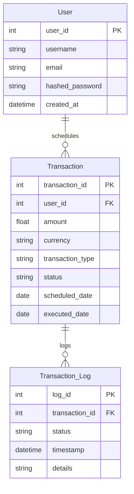
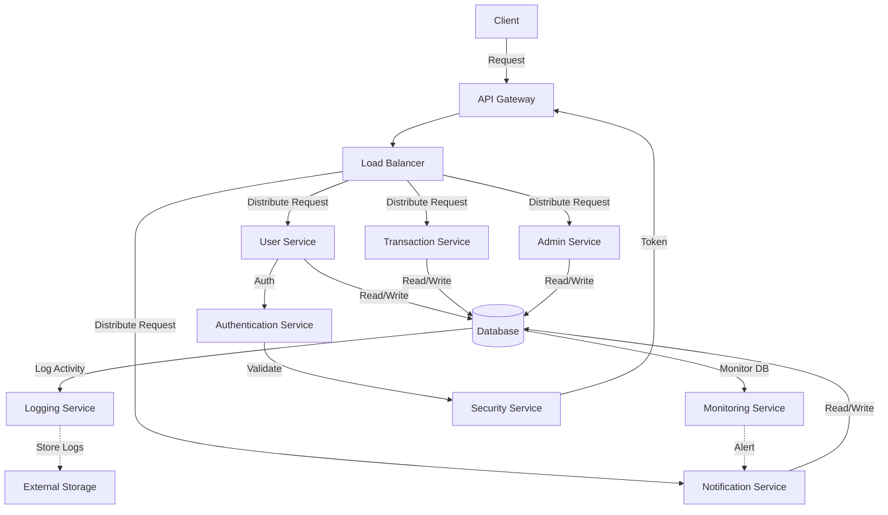
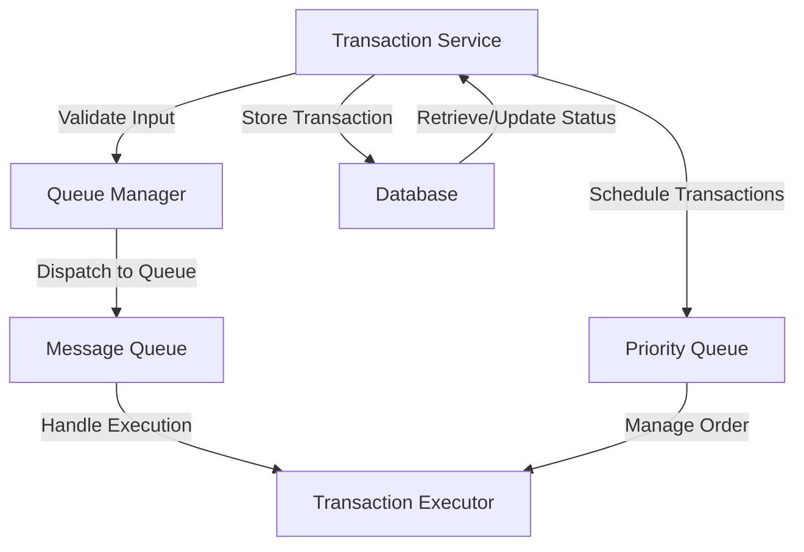
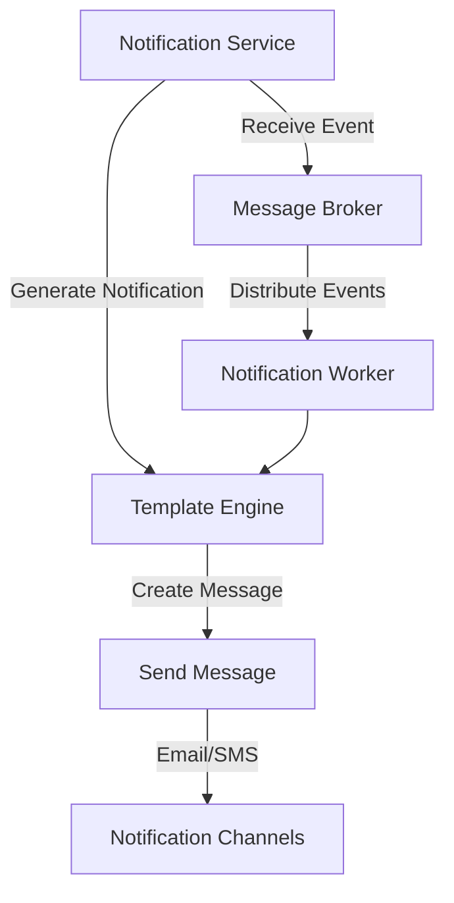

# Design a Scheduled Digital Transaction System

## System Requirements

### Functional
Functional requirements describe what the system should do. Here are some suggested requirements for our system:

- **Transaction Scheduling**: Users should be able to schedule different types of transactions including one-time, recurring, and conditional payments.
- **User Management**: The system should manage user accounts including authentication, authorization, and password management.
- **Notification System**: Users should receive notifications regarding the status of their transactions, including successes and failures.
- **Admin Panel**: For back-end management, including transaction oversight and user account management.
- **Reporting and Analytics**: Generate reports for transactions, spotting trends, and tracking transaction history.
- **Security Features**: Ensure data encryption, secure data storage, and secure transmission protocols.

### Non-Functional
Non-functional requirements describe how the system operates, underlining the quality attributes of the system:

- **Scalability**: The system must handle a high number of transactions and users without degradation of performance.
- **Reliability**: Achieve high availability with minimal downtime.
- **Usability**: Interface must be user-friendly for both end-users and administrators.
- **Security**: Implement robust security measures to protect against fraud and cyber threats.
- **Performance**: Transactions should be processed in a timely fashion, with real-time processing capabilities as needed.
- **Maintainability**: Code and systems should be designed for easy maintenance and future upgrades.

## Capacity Estimation

### Assumptions
To estimate the system's capacity, we need to make a few assumptions about usage patterns and transaction volumes:

- **Number of Users**: Estimate the number of active users who will use the system. For instance, we might start with 100,000 active users.
- **Transaction Frequency**: Estimate how often these users will schedule transactions. Let’s assume each user schedules 3 transactions monthly.
- **Peak Load**: Identify peak hours during which transaction volume might double.

### Calculation
Based on the above assumptions:

- **Monthly transactions** = 100,000 users × 3 transactions/user = 300,000 transactions per month.
- If we estimate peak hours to see 10% of daily transactions, then:
  - **Daily transactions** = 300,000 transactions / 30 days ≈ 10,000 transactions.
  - **Peak hour transactions** = 10% of daily transactions = 1,000 transactions in the peak hour.

### System Requirements
To handle these transactions smoothly:

- **Database Operations**: Capable of handling at least 50 writes per second during peak times (as transactions might involve multiple database interactions).
- **Storage**: Sufficient storage for user data, transaction logs, and backups. Assuming small metadata per transaction, storage should scale with user base and retention policy.
- **Network Bandwidth**: Ensure adequate bandwidth to support data transmission needs during peak loads.

## API Design

The APIs will be structured to facilitate core functionalities such as user management, transaction scheduling, and system administration.

### User Authentication API

Authenticate users and provide tokens for session management.

```http
POST /api/auth
```
**Request Body**:
```json
{
  "username": "user@example.com",
  "password": "password123"
}
```
**Response**:
```json
{
  "token": "ey123.ey456.789xyz"
}
```

### Schedule Transaction API

Schedule a new transaction for execution.

```http
POST /api/transactions/schedule
```
**Request Body**:
```json
{
  "user_id": 1,
  "amount": 100.00,
  "currency": "USD",
  "transaction_type": "one-time",
  "scheduled_date": "2024-10-20"
}
```
**Response**:
```json
{
  "transaction_id": 12345,
  "status": "scheduled"
}
```

### Check Transaction Status API

Retrieve the status of a scheduled transaction.

```http
GET /api/transactions/status?transaction_id=12345
```
**Response**:
```json
{
  "transaction_id": 12345,
  "status": "completed",
  "execution_date": "2024-10-20",
  "details": "Payment of $100 to account XYZ"
}
```

### Admin API to Oversee Transactions

View all transactions within the system for monitoring and management purposes.

```http
GET /api/admin/transactions
```
**Response**:
```json
{
  "transactions": [
    {
      "transaction_id": 12345,
      "user_id": 1,
      "status": "completed",
      "amount": 100.00,
      "currency": "USD",
      "scheduled_date": "2024-10-20"
    }
  ]
}
```

## Database Design

We will use a relational database model for our system. Here's a proposed Entity-Relationship (ER) diagram and corresponding descriptions:

### Entities and Attributes

- **User**: user_id, username, email, hashed_password, created_at
- **Transaction**: transaction_id, user_id, amount, currency, transaction_type, status, scheduled_date, executed_date
- **Transaction_Log**: log_id, transaction_id, status, timestamp, details

### Relationships

- A User can have multiple Transactions (One-to-Many).
- A Transaction generates multiple Transaction_Logs (One-to-Many).



## High-Level Design

The system architecture will be based on a microservices model to ensure scalability, maintainability, and robust fault isolation.

### Key Components

- User Service
- Transaction Service
- Notification Service
- Admin Service
- Database
- API Gateway
- Load Balancer



## Request Flows

Sequence diagram for a transaction scheduling flow:

mermaid

sequenceDiagram
    participant Client
    participant API_Gateway as API Gateway
    participant Load_Balancer as Load Balancer
    participant Transaction_Service as Transaction Service
    participant Database
    participant Notification_Service as Notification Service
    Client->>+API_Gateway: Submit transaction request
    API_Gateway->>+Load_Balancer: Forward request
    Load_Balancer->>+Transaction_Service: Route request
    Transaction_Service->>+Database: Store transaction details
    Database-->>-Transaction_Service: Confirm storage
    Transaction_Service->>+Notification_Service: Send notification (optional)
    Notification_Service-->>-Transaction_Service: Confirm send
    Transaction_Service-->>-API_Gateway: Return confirmation
    API_Gateway-->>-Client: Display result


## Detailed Component Design

### Transaction Service

- Stateless, uses queues and priority execution.
- Scales horizontally.



### Notification Service

- Event-driven using a publish-subscribe pattern.
- Supports email and SMS.



## Trade-offs / Tech Choices

### Microservices Architecture

- Pros: Scalability, maintainability.
- Cons: Complexity, consistency.

### Relational Database

- Pros: ACID, mature tech.
- Cons: Scalability limits.

### Message Queues

- Pros: Decoupling, reliability.
- Cons: Operational overhead.

### Event-Driven Notifications

- Pros: Real-time, scalable.
- Cons: Event consistency challenges.

## Technology Stack

- **Frontend**: React or Angular
- **Backend**: Node.js or Java (Spring Boot)
- **Database**: PostgreSQL
- **Queue**: Kafka
- **Load Balancer**: Nginx / HAProxy
- **Monitoring**: Prometheus, ELK Stack

## Future Improvements

- Integrate ML for fraud detection.
- Use blockchain for transaction auditability.
- Service mesh for service-to-service communication.
- Advanced analytics and reporting.
